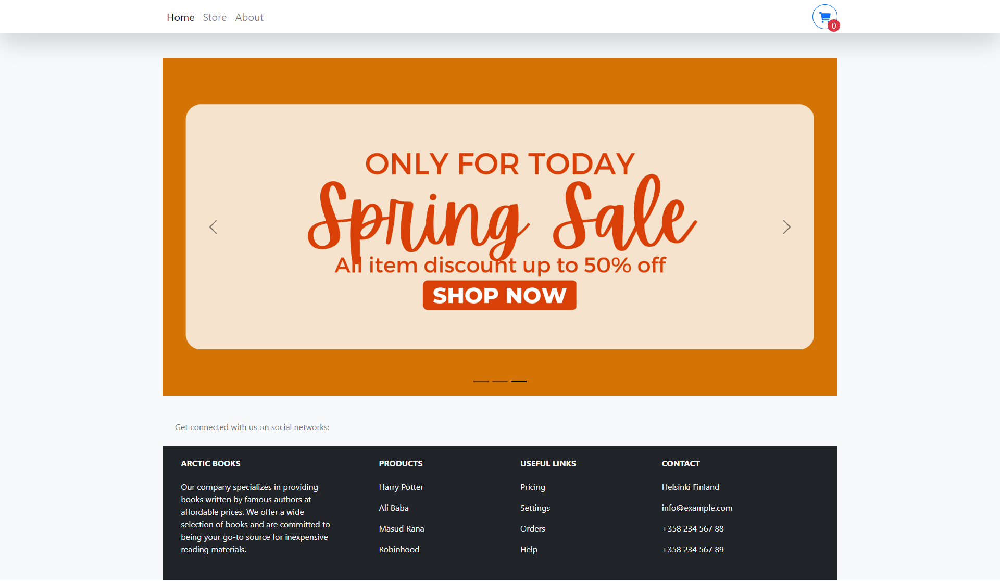
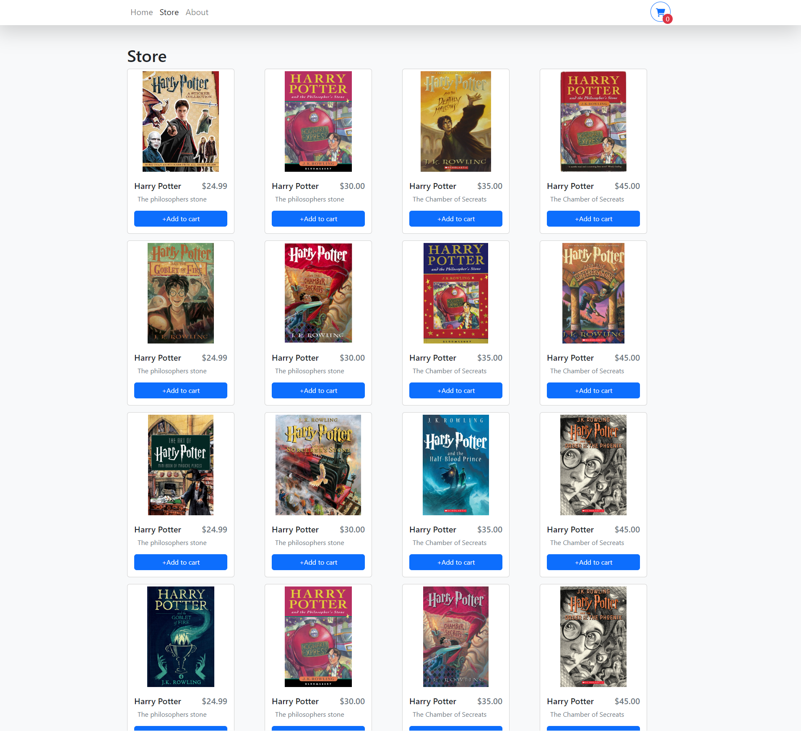
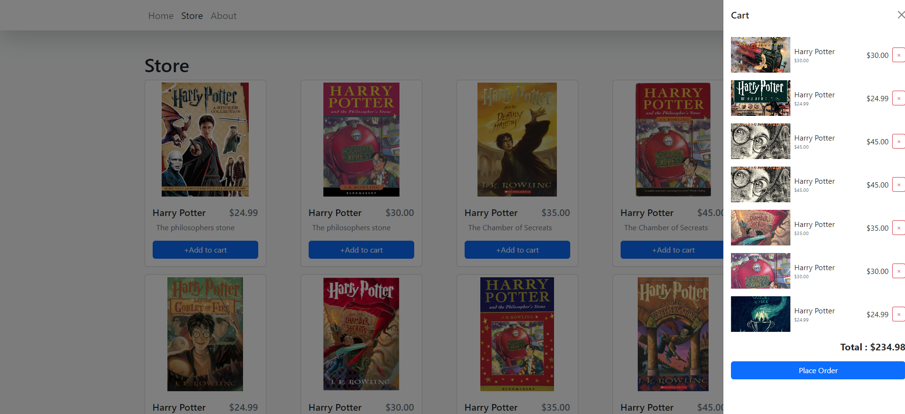

## Badges

# Online Book Store (ARCTIC BOOKS)

This project is a team-based TypeScript final project that aims to create a user-friendly online bookstore. The main objective is to develop an interface that is easy to navigate, as well as a dynamic shopping cart system. We utilized React and React Bootstrap to create the application, and for the shopping cart, we utilized the React useContext hook.

The outcome of this project is an online bookstore that is simple to use, and that features a user-friendly interface and a dynamic shopping cart system. It's designed to make shopping easy, as customers can easily add items to their carts and checkout in just a few clicks.

Overall, our team was able to create a robust and functional application that is sure to provide an excellent experience for customers.

## Tech Stack

- TypeScript
- React
- React Bootstrap
- Css

## Author

- @hasanmd91 MD ABUL HASAN
- @preetiag18 Preeti Agrawal
- @ttcchub Nikita Lyudikaynen

## Demo

[Live Link](https://bookishshop.netlify.app/)

## Screenshots

